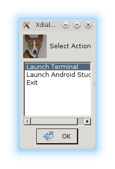

Dockerized Android Development Environment with Vagrant
=======================================================

Introduction
------------

These Docker and Vagrant (and supporting) files allow one to create a fully self-contained Android development environment. All the necessary software is downloaded and configured, making set-up easy.

Within this (Fedora 21) environment, the following features are available:

* Android Studio (1.1.0), with IdeaVIM plugin (hey, we've all got our editing biases!)
* Java downloaded and installed (Currently, Oracle Java 8u45)
* Accelerated Android Emulator (assuming VTX is available)
* Access to connected Android devices through the container
* All the necessary Fedora packages for the above
* All GUIs are run leveraging your local X server (ie, no VNC'ing or ssh'ing to run programs like Android Studio).
* The environment uses [Docker volumes](https://docs.docker.com/reference/builder/#volume) to map a directory that will be used as the dev user's home directory. It's in this directory where you can store persistent data (Android studio settings, code, etc).

**NOTE: Vagrant makes it easy to package up extra Docker configuration. It's also supposed to allow you to set up Docker under non-Linux environments. However, I have not tested this. (See [Limitations](#limitations) section.)**

Getting Up and Running
----------------------
1. Download and install [Vagrant](http://www.vagrantup.com). Note: Tested with 1.7.2
1. Download and install [Docker](http://www.docker.com). (Make sure the docker service is running) Note: Tested with [1.5.0*](#version)
1. Retrieve the dev-android files.

        git clone https://hasuf@bitbucket.org/trumpa/dev-android.git

1. There are some things you might want to consider before launching Vagrant:
    1. **User and Group ID.** To make things easy on you and allow you to interoperate with files 
       both inside and outside the container, you might want to edit the id's of the user and its   
       group. ie, in the Dockerfile, edit the lines:
         
                RUN groupadd -g 1000 devuser        
                RUN useradd -g 1000 -u 600  -ms /bin/bash devuser
        
        so that the id's for the group and user match your own in your local environment. You can 
        determine your own user and group id by running the following commands in your local 
        environment:

                $ # determine my user id
                $ id -u
                681
                $ # determine my group id
                $ id -g
                1048
        
        Replace the 1000 and 600 with your own group id and user id, respectively. eg (from the above 
        example):

                RUN groupadd -g 1048 devuser        
                RUN useradd -g 1048 -u 681  -ms /bin/bash devuser
        
        Once this is done, anytime you edit files in the container, you'll by default have the same 
        ownership as your normal user outside the container.

      1. **DEVDIR.** Determine where, on your filesystem, you want to designate the dev user's home 
      directory. eg, if you may want to designate `/home/myaccount/work` as your android development 
      path. This results in the ability to persist data between your local environment and the 
      container. **NOTE that the path must already exist.**

   1. Give you permission for the containerized GUIs to access your X server:

                $ xhost +local:
      
      (You might want to consider adding that to your .bashrc file.)
                
   1. Launch Vagrant. The Vagrantfile requires setting that the DEVDIR be passed as an environment 
      variable. If DEVDIR is not set, you'll get an error.

      For example:
       
                sudo DEVDIR=/home/myaccount/work vagrant up
                
      Note, that on first launch, when Docker needs to set up the container, setup can take tens of 
      minutes. However, after that, starting up the container with Vagrant should be quick.
            
   

Quick User Guide
----------------
When you fire up the Docker environment, and after all the software is downloaded, installed, and configured (it will take a while to download and configure everything), you're presented with a simple launcher that allows you to either start up Android Studio, launch a terminal window (from within the container's context), or exit the container. 

You can launch as many terminals as you like, but you can only launch the Android Studio once.

The launcher is just an XDialog running in a loop. Selecting anything besides Exit will bring the launcher up again. Just minimize it 

Exiting will cause the Docker session to end (therefore, it's a good idea to make sure you don't have any processes like Android Studio with unsaved data).

**A Note on the Terminal** Just for kicks, I install and use [Terminology](https://github.com/billiob/terminology) for the containerized terminal. (For one, it helps me distinguish between my regular Konsole terminal icons and the container-based Terminology ones.) If you prefer using a different terminal emulator, change these lines in the Dockerfile to use your favorite terminal program instead of *terminology*:

        # install a good terminal 
        RUN yum -y install terminology
        ...
        # give the name of the terminal program to run
        CMD /usr/bin/bash /usr/local/bin/init.sh terminology

Limitations 
-----------
As mentioned in the introduction, one of the intents for this project was to have a single environment set up for any platform (Linux, Mac, etc). Vagrant should automatically launch Docker in a container-supported OS within VirtualBox. However, I have not tested this, nor am I yet certain how to enable things like access to an attached device. Running GUIs using X should be doable, as noted in the References section.

References
----------    
1. [Setting up a development environment using Docker and Vagrant](http://blog.zenika.com/index.php?post/2014/10/07/Setting-up-a-development-environment-using-Docker-and-Vagrant), Blog Zenika, 2014-10-07 
1. [Running GUI apps with Docker](http://fabiorehm.com/blog/2014/09/11/running-gui-apps-with-docker/), Fábio Rehm, 2014-09-11
1. Running GUIs on OSX
   1. [How to run a Linux GUI application on OSX using Docker](http://kartoza.com/how-to-run-a-linux-gui-application-on-osx-using-docker/), Tim Sutton, 2015-04-14
   1. [Fiji Docker Docs, "On OSX" Section](http://fiji.sc/Docker#On_OSX)

Footnotes
---------
* Between the time I started this project and the writing of this README, an updated Fedora package for docker-io had been released (1.6.0-2.git3eac457). I'm noticing weird interactions between Vagrant 1.7.2 and this version of docker-io. Let me know if notice anything weird, too. When I downgraded a separate local environment back to docker-io-1.5.0-2, things were working again.